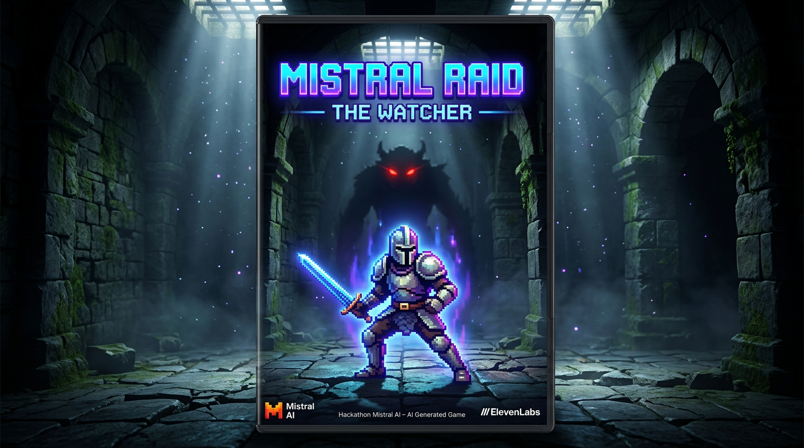

# Mistral Raid — The Watcher in the Depths

> **Hackathon:** Mistral Worldwide Hackathon | Feb 28 – Mar 1, 2026



A dungeon crawler where the final boss runs on Mistral AI. It transcribes your voice with Voxtral realtime STT, cross-references what you said against live combat telemetry, and generates a personalized taunt and attack mechanics on the fly. Trash-talk a boss that knows your accuracy is 34% and you've spent 40% of the fight hiding in a corner, then hear it say so out loud, voiced by ElevenLabs. Every sound in the game (40+ SFX, 7 music tracks, and the boss voice itself) is AI-generated, with adaptive telemetry shifting the music mood live based on combat state. Built with four Mistral models across four independent AI agents running simultaneously: The Architect (boss brain), the Dungeon Director (adaptive difficulty), the Dungeon Companion (tactical chat with voice queries), and an AI Co-Op partner that literally plays the game alongside you.

---

## What We Built

### 1. The Dungeon Crawler (the foundation)

A complete, polished top-down dungeon crawler built in Phaser 3:

- **5 levels** of procedurally generated dungeons (BSP room placement)
- **4 playable characters** — Knight, Rogue, Mage, Paladin — each with distinct stats
- **5 weapons** with distinct behaviors — Sword, Dagger, Katana, Hammer, Bomb
- **10 enemy types** with individual AI (MeleeChase, Ranged, Shielded, Exploder, and more)
- **5 boss encounters** (one per level), each with multi-phase tint + behavior changes
- Full **inventory system** with weapons, items, rarity tiers, and equip slots
- **Save/load** via localStorage (auto-saves on boss kill and floor transitions)
- **Minimap**, fog-of-war lighting, loot drops, chest interactions, score tracking
- All game scenes: Boot, Menu, Player Select, Level, Pause, Inventory, Options, Credits, Game Over, Victory

### 2. The AI Boss Fight (THE ARCHITECT)

The arena boss fight is the core of the submission. Here's how it works:

1. **Phase 1** — The boss attacks with hardcoded escalating patterns (spray, slam, sweep, chase shots) while a `TelemetryTracker` silently records everything the player does.
2. **Phase transition** — An `AnalyzingOverlay` appears. The telemetry summary is sent to Mistral.
3. **Mistral responds** — THE ARCHITECT system prompt instructs the model to analyze the player's specific habits (movement zones, dodge direction bias, accuracy, corner-camping percentage, damage taken by type) and return:
   - A 1–2 sentence analysis of the player's weaknesses
   - A menacing taunt (under 30 words) referencing specific numbers from their telemetry
   - 2–3 attack mechanics designed to counter their playstyle
4. **The boss speaks** — The taunt is synthesized via ElevenLabs TTS (voice: Adam) and played over the game audio with music ducking.
5. **Phase 2** — The boss executes the AI-generated mechanics. If the player survives, the cycle repeats.

**What Mistral sees (telemetry):**

| Field | Description |
|-------|-------------|
| Movement heatmap | 9-zone grid showing where the player spends time |
| Dodge direction bias | Which way they dash most |
| Accuracy | Shots fired vs hits landed |
| Corner time % | How much they camp corners |
| Reaction time | Gap between attack telegraph and dodge |
| Damage by type | Melee / projectile / hazard breakdown |
| Avg distance from boss | Aggressive vs passive play detection |

**Attack mechanic types (AI can generate any combination):**

| Type | Behavior |
|------|----------|
| `projectile_spawner` | Bullets in spiral / fan / ring / aimed / random patterns, optional homing |
| `hazard_zone` | Warning + damage zone (circle or rectangle) |
| `laser_beam` | Sweeping beam (horizontal / vertical / diagonal / tracking) |
| `homing_orb` | Velocity-lerp tracking projectiles |
| `wall_of_death` | Sweeping walls with a survivable gap |
| `minion_spawn` | Summoned enemies (chase / orbit / kamikaze) |

All AI-generated numeric values are clamped server-side before reaching the game engine. No `eval()` — the AI's JSON maps to pre-built mechanic classes only.

### 3. Voxtral Realtime Speech-to-Text

The player can speak into their microphone and have the boss respond to their words.

- Browser captures mic audio via `getUserMedia()`
- Audio is streamed as PCM S16LE 16kHz mono through a WebSocket to the server
- **Voxtral** (`voxtral-mini-transcribe-realtime-2602`) transcribes it in real time using the `@mistralai/mistralai` SDK `RealtimeTranscription` class
- The transcript is injected into the Mistral boss brain prompt alongside telemetry
- Warm connections are pre-established between turns to minimize latency

### 4. AI Dungeon Companion

A second Mistral-powered system — the dungeon companion — runs throughout the dungeon crawler:

- A slide-out chat panel (`Tab` key) is always accessible during gameplay
- The player can type questions or click quick-action buttons ("Where is the boss?", "Am I safe?", "Find treasure")
- The server constructs a `CompanionContext` (player position, enemy positions and HP, boss state, nearby treasure) and sends it to Mistral
- Mistral responds with tactical guidance, directional hints, and proximity alerts
- Voice input is supported (coin-gated at 2 coins per activation): player speaks, Voxtral transcribes, Mistral answers
- The companion reply is displayed in the panel and optionally voiced via ElevenLabs TTS

### 5. AI Co-Op Mode

A dedicated co-op mode lets Mistral literally play the game alongside the human player:

- Select "AI Co-Op Mode" from the main menu, pick a companion personality
- **4 personalities:** Aggressive (max damage), Tactical (target weakest first), Protector (keep player alive), Balanced
- Every 800ms, the server sends Mistral the current combat context and receives a `CompanionDecision`: movement direction, attack target, whether to dash, whether to shield the player, and a spoken line
- The AI companion is a full second player entity — it moves, attacks, dashes, and can speak taunts during the fight
- ElevenLabs TTS voices the companion's lines when voice mode is enabled

### 6. Adaptive Audio System

ElevenLabs powers all audio, generated from text prompts and cached server-side:

- **40+ SFX categories** — footsteps, weapon hits (per weapon type), dash, shield, enemy sounds, boss intro/death, UI sounds, heartbeat
- **7 music tracks** — menu, dungeon ambient, combat, boss fight, game over, victory, credits
- **Adaptive telemetry loop** — client sends combat state every second; server returns a `musicMood` and volume multiplier; AudioManager ramps to it over 1.5s
- **Spatialized SFX** — distance attenuation + stereo pan (`playSFXAt()`)
- **Heartbeat** — triggers at player HP < 30%, auto-stops on recovery
- **Fallback tones** — oscillator-based synthetic audio when server is unavailable

---

## Models Used

| Model | Role |
|-------|------|
| **`mistral-small-latest`** | Primary boss brain (THE ARCHITECT) — analyzes telemetry, generates taunts + attack mechanics |
| **`ministral-8b-latest`** | Boss brain fallback (activates if primary times out at 4s) |
| **`mistral-large-latest`** | Boss brain in DEMO_MODE=true for highest quality output |
| **`voxtral-mini-transcribe-realtime-2602`** | Realtime speech-to-text — transcribes player mic input during boss fight and dungeon companion queries |
| **`mistral-small-latest`** (second instance) | AI dungeon companion — answers player questions about the dungeon in real time |
| **`mistral-small-latest`** (third instance) | AI co-op companion — makes tactical combat decisions every 800ms |
| **ElevenLabs `eleven_flash_v2_5`** | Boss voice TTS — speaks THE ARCHITECT's taunts aloud (voice: Adam) |
| **ElevenLabs (SFX/music)** | Generates all 40+ SFX categories and 7 music tracks from text prompts |

---

## Architecture

```
Browser (Phaser 3 + TypeScript)          Server (Node.js + Express, :8787)
─────────────────────────────────        ─────────────────────────────────
ArenaScene                               WebSocketServer
  TelemetryTracker ──── WS ────────────► voxtralSTT ─── Voxtral API
  MechanicInterpreter ◄─ WS ───────────  mistralService ─ Mistral API
  BossVoicePlayer ◄──── WS ──────────── bossVoiceService ─ ElevenLabs API
  AnalyzingOverlay                       sessionManager
  DevConsole                             telemetryProcessor

LevelScene
  AssistantChat ────── HTTP ──────────► /api/companion/query ─ Mistral API
  VoiceController ──── HTTP ──────────► (mic → Voxtral → Mistral)
  CoopState ──────────── HTTP/WS ─────► aiCompanionCombatAgent ─ Mistral API

AudioManager ────────── HTTP ──────────► /api/audio/* ─ ElevenLabs API
```

**WebSocket message protocol:**

```
Client → Server:  ANALYZE (telemetry + player speech)
                  AUDIO_CHUNK (raw PCM mic data)
Server → Client:  BOSS_RESPONSE (taunt + mechanics + analysis)
                  AUDIO_READY (base64 TTS audio)
                  STT_PARTIAL / STT_FINAL (transcription stream)
                  AI_ASSISTANT_REPLY (dungeon companion response)
                  COOP_DECISION (AI companion move/attack/speak)
```

---

## Quick Start

```bash
# Install all dependencies
npm install
cd server && npm install && cd ..

# Set API keys
cp server/.env.example server/.env
# Fill in: MISTRAL_API_KEY, ELEVENLABS_API_KEY

# Run audio + AI server
cd server
npm start   # → http://localhost:8787

# Run the game (separate terminal)
npm run dev  # → http://localhost:5173
```

---

## Technical Constraints (Non-Negotiable)

1. **No `eval()`** — AI-generated JSON maps to pre-built mechanic classes only
2. **Value clamping** — All AI-generated numerics are validated and clamped server-side before reaching the game
3. **Fallback always works** — Every AI path has a cached fallback response; the game is fully playable without any API connectivity
4. **Model cascade** — Boss brain tries `mistral-small-latest` (4s) → `ministral-8b-latest` (2s) → cached fallback, ensuring the game never hangs
5. **Warm connections** — Voxtral STT connections are pre-warmed between turns to minimize the speech → response latency

---

## Project Structure

```
client/src/
  scenes/        All game scenes (Arena, Level, Menu, etc.)
  entities/      Player, BossEntity, Enemy, Item
  systems/       AudioManager, TelemetryTracker, MechanicInterpreter,
                 AssistantChat, VoiceController, CoopState, MiniMap, etc.
  mechanics/     6 AI mechanic classes (ProjectileSpawner, HazardZone, etc.)
  ui/            ArenaHUD, DevConsole, TauntText, AnalyzingOverlay, DirectorPanel
  network/       WebSocketClient
  core/          GameState, MazeGenerator, BossFactory, EnemyFactory

server/src/
  index.ts                Express entry point on :8787
  ws/WebSocketServer.ts   WebSocket server
  services/               mistralService, voxtralSTT, bossVoiceService,
                          sessionManager, telemetryProcessor, aiDirector,
                          elevenlabsAudioService, elevenlabsMusicService
  agents/                 aiCompanionCombatAgent, gameCompanionAgent
  routes/                 audio, boss, companion
```
